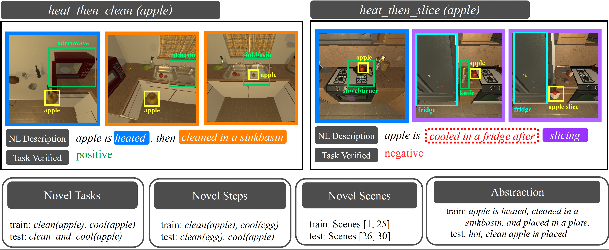

# EgoTV: Egocentric Task Verification from Natural Language Task Descriptions
******************************************************


This repo has the implementation of our paper: [EgoTV: Egocentric Task Verification from Natural Language Task Descriptions](https://arxiv.org/abs/2303.16975)


## To set-up the AI2-THOR environment

### Clone the repository
```
$ git clone https://github.com/facebookresearch/EgoTV.git
$ export GENERATE_DATA=$(pwd)/EgoTV/alfred
$ cd $GENERATE_DATA
```
We have build the dataset generation code on top of [ALFRED dataset [3] repository.](https://github.com/askforalfred/alfred)

### Install all requirements
```
$ conda create -n <virtual_env> python==3.10.0
$ source activate <virtual_env>
$ bash install_requirements.sh
```

**************************************************************


## Data Generation

[comment]: <> (Get dependencies and compile the planner)

[comment]: <> (```)

[comment]: <> ($ sudo apt-get install ffmpeg flex bison)

[comment]: <> ($ cd $GENERATE_DATA/gen/ff_planner)

[comment]: <> ($ make)

[comment]: <> (```)

### Generate dataset
```
$ cd $GENERATE_DATA/gen
$ python scripts/generate_trajectories.py --save_path <your save path> --split_type <split_type>

# append the following to generate with multiprocessing for faster generation
# --num_threads <num_threads> --in_parallel 
```
The data is generated in: *save_path*  
Here, split_type can be one of the following [*"train", "novel_tasks", "novel_steps",
                                 "novel_scenes", "abstraction"*]

### Generate Layouts
If you want to generate new layouts (aside from the generated layouts in [alfred/gen/layouts](https://github.com/facebookresearch/EgoTV/tree/main/alfred/gen/layouts)),

```
$ cd $GENERATE_DATA/gen
$ python layouts/precompute_layout_locations.py 
```

Alternatively, the pre-built layouts can be downloaded from <https://www.dropbox.com/s/11cvvvcm4v7c5xg/layouts.zip?dl=0> and saved to the path alfred/gen/layouts/


### Download pddl files for tasks: 
The pddl task files can be downloaded from <https://www.dropbox.com/s/yd50ruzqasq6idm/domains.zip?dl=0> and saved to the path alfred/gen/planner/domains/


### Define new goals and generate data corresponding to those goals

* Define the goal conditions in [alfred/gen/goal_library.py](https://github.com/facebookresearch/EgoTV/blob/main/alfred/gen/goal_library.py)
* Add the list of goals in [alfred/gen/constants.py](https://github.com/facebookresearch/EgoTV/blob/main/alfred/gen/constants.py)
* Add the goal_variables in [alfred/gen/scripts/generate_trajectories.py](https://github.com/facebookresearch/EgoTV/blob/main/alfred/gen/scripts/generate_trajectories.py)
* Run the following commands:
```
$ cd $GENERATE_DATA/gen
$ python scripts/generate_trajectories.py --save_path <your save path>
```

To simply run the fastforward planner on the generated pddl problem
```
$ cd $GENERATE_DATA/gen
$ ff_planner/ff -o planner/domains/PutTaskExtended_domain.pddl -s 3 -f logs_gen/planner/generated_problems/problem_<num>.pddl
```

### Generated dataset tree
```
dataset/
├── test_splits
│   ├── abstraction
│   ├── novel scenes
│   ├── novel tasks
│   └── novel steps
└── train
|   ├── heat_then_clean_then_slice
|   │   └── Apple-None-None-27
|   │       └── trial_T20220917_235349_019133
|   │           ├── pddl_states
|   │           ├── traj_data.json
|   │           └── video.mp4
```

### Test Splits

[$GENERATE_DATA/gen/scripts/generate_trajectories.py](https://github.com/facebookresearch/EgoTV/blob/main/alfred/gen/scripts/generate_trajectories.py)  
Note, no two splits (train or test) have overlapping examples.

#### [Scenes: 1-25]
1. **novel tasks**:
    >* all tasks not in train

2. **novel steps**: 
    >* heat(egg)
    >* clean(plate)
    >* slice(lettuce)
    >* place(in, shelf)

3. **abstraction**:
    >* all train tasks with highly abstracted hypothesis ([$GENERATE_DATA/gen/goal_library_abstraction.py](https://github.com/facebookresearch/EgoTV/blob/main/alfred/gen/goal_library_abstraction.py))
    >* for the rest of the splits ([$GENERATE_DATA/gen/goal_library.py](https://github.com/facebookresearch/EgoTV/blob/main/alfred/gen/goal_library.py))
    
#### [Scenes: 26-30]
4. **novel scenes**: 
    >* all train tasks in scenes in 26-30




## Dataset Stats 
For details: [ablations/data_analysis.ipynb](https://github.com/facebookresearch/EgoTV/blob/main/ablations/data_analysis.ipynb)

* Total hours: 168 hours
  * Train: 110 hours
  * Test: 58 h
* Average video-length = 84s
* Tasks: 82
* Objects > 130 (with visual variations)
* Pickup objects: 32 (with visual variations)
* Receptacles: 24 (including movable receptacles)
* Sub-tasks: 6 (pick, place, slice, clean, heat, cool)
* Average number of sub-tasks per sample: 4.6
* Scenes: 30 (Kitchens)

For additional details of the collected dataset trajectory, see: [alfred/README.md](https://github.com/facebookresearch/EgoTV/tree/main/alfred)

**************************************************************

## Baselines

### Setup Baselines:

all baseline models are in the filepath: [baselines/all_train](https://github.com/facebookresearch/EgoTV/tree/main/baselines/all_train)
```
$ export DATA_ROOT=<path to dataset>
$ export BASELINES=$(pwd)/EgoTV/baselines
$ cd $BASELINES
$ bash install_requirements.sh
```

Alternatively, we provide a [Dockerfile](https://github.com/facebookresearch/EgoTV/blob/main/Dockerfile) for easier setup.

### VIOLIN [1] baseline
* text encoders: GloVe, (Distil)-BERT uncased [10], CLIP [5]
* visual_encoders: ResNet18, I3D [4], S3D [7], MViT [6], CLIP [5]
```
$ ./run_scripts/run_violin_train.sh  # for train
$ ./run_scripts/run_violin_test.sh  # for test
# if data split not preprocessed, specify "--preprocess" in the run instruction
# for attention-based models, specify "--attention" in the run instruction
# to resume training from a previously stored checkpoint, specify "--resume" in the run instruction
```

Note: to run the I3D and S3D models, download the pretrained model (rgb_imagenet.pt, S3D_kinetics400.pt) from these repositories respectively: 
* [https://github.com/piergiaj/pytorch-i3d/tree/master/models](https://github.com/piergiaj/pytorch-i3d/tree/master/models)
* [https://github.com/kylemin/S3D](https://github.com/kylemin/S3D)
```
$ mkdir $BASELINES/i3d/models
$ wget -P $BASELINES/i3d/models "https://github.com/piergiaj/pytorch-i3d/tree/master/models/rgb_imagenet.pt" "https://github.com/piergiaj/pytorch-i3d/tree/master/models/rgb_charades.pt"
$ wget -P $BASELINES/s3d "https://drive.google.com/uc?export=download&id=1HJVDBOQpnTMDVUM3SsXLy0HUkf_wryGO"
```

### Other baselines
clip4clip (Clip4Clip [14]), coca [12], text2text (Socratic [15]), videoclip [13], modify and run from root:
```
$ ./run_scripts/run_<baseline>_train.sh
$ ./run_scripts/run_<baseline>_test.sh
```
#### CoCa setup [12]
* download [CoCa model](https://github.com/mlfoundations/open_clip) from OpenCLIP (coca_ViT-B-32 finetuned on mscoco_finetuned_laion2B-s13B-b90k)

#### VideoCLIP setup [13]
The VideoCLIP has conflicting packages with EgoTV, hence we setup a new environment for it.

* create a new conda env since the packages used are different from EgoTV packages
```
conda create -n videoclip python=3.8.8
source activate videoclip
```
* clone the repo and run the following installations
```
$ git clone https://github.com/pytorch/fairseq
$ cd fairseq
$ pip install -e .  # also optionally follow fairseq README for apex installation for fp16 training.
$ export MKL_THREADING_LAYER=GNU  # fairseq may need this for numpy
$ cd examples/MMPT  # MMPT can be in any folder, not necessarily under fairseq/examples.
$ pip install -e .
$ pip install transformers==3.4
```

* download the checkpoint using
```
wget -P runs/retri/videoclip/ "https://dl.fbaipublicfiles.com/MMPT/retri/videoclip/checkpoint_best.pt"	
```

### Run proScript
* for more details, see [baselines/proScript](https://github.com/facebookresearch/EgoTV/tree/main/baselines/proScript)
```
$ source activate alfred_env
$ export DATA_ROOT=<path to dataset>
$ export BASELINES=$(pwd)/EgoTV/baselines
$ cd $BASELINES/proScript

# train
$ CUDA_VISIBLE_DEVICES=0,1,2,3,4,5,6,7 python -m torch.distributed.launch --nproc_per_node=8 train_supervised.py --num_workers 4 --batch_size 32 --preprocess --test_split <> --run_id <> --epochs 20
# test
$ CUDA_VISIBLE_DEVICES=0,1,2,3,4,5,6,7 python -m torch.distributed.launch --nproc_per_node=8 test.py --num_workers 4 --batch_size 32 --preprocess --test_split <> --run_id <>
```
<--output_type 'nl'> for natural language graph output; 
<--output_type 'dsl'> for domain-specific language graph output (default: dsl)

**************************************************************

## NSG Model

```
$ ./run_scripts/run_nsg_train.sh  # for nsg train
$ ./run_scripts/run_nsg_test.sh  # for nsg test
```
**************************************************************

## References
[1] Jingzhou Liu, Wenhu Chen, Yu Cheng, Zhe Gan, Licheng Yu, Yiming Yang, Jingjing Liu ["VIOLIN: A Large-Scale Dataset for Video-and-Language Inference"](https://openaccess.thecvf.com/content_CVPR_2020/papers/Liu_Violin_A_Large-Scale_Dataset_for_Video-and-Language_Inference_CVPR_2020_paper.pdf). In CVPR 2020  
[2] Eric Kolve, Roozbeh Mottaghi, Winson Han, Eli VanderBilt, Luca Weihs, Alvaro Herrasti, Matt Deitke, Kiana Ehsani, Daniel Gordon, Yuke Zhu, Aniruddha Kembhavi, Abhinav Gupta, Ali Farhadi ["AI2-THOR: An Interactive 3D Environment for Visual AI"](https://arxiv.org/pdf/1712.05474.pdf)  
[3] Mohit Shridhar,	Jesse Thomason,	Daniel Gordon,	Yonatan Bisk, Winson Han, Roozbeh Mottaghi,	Luke Zettlemoyer, Dieter Fox ["ALFRED: A Benchmark for Interpreting Grounded Instructions for Everyday Tasks"](https://arxiv.org/abs/1912.01734) In CVPR 2020  
[4] Joao Carreira, Andrew Zisserman ["Quo Vadis, Action Recognition? A New Model and the Kinetics Dataset"](https://openaccess.thecvf.com/content_cvpr_2017/papers/Carreira_Quo_Vadis_Action_CVPR_2017_paper.pdf) In CVPR 2017  
[5] Alec Radford, Jong Wook Kim, Chris Hallacy, Aditya Ramesh, Gabriel Goh, Sandhini Agarwal, Girish Sastry, Amanda Askell, Pamela Mishkin, Jack Clark, Gretchen Krueger, Ilya Sutskever ["Learning Transferable Visual Models From Natural Language Supervision"](http://proceedings.mlr.press/v139/radford21a/radford21a.pdf) In ICML 2021  
[6] Haoqi Fan, Bo Xiong, Karttikeya Mangalam, Yanghao Li, Zhicheng Yan, Jitendra Malik, Christoph Feichtenhofer ["Multiscale Vision Transformers"](https://openaccess.thecvf.com/content/ICCV2021/papers/Fan_Multiscale_Vision_Transformers_ICCV_2021_paper.pdf) In ICCV 2021  
[7] Saining Xie, Chen Sun, Jonathan Huang, Zhuowen Tu, Kevin Murphy ["Rethinking Spatiotemporal Feature Learning: Speed-Accuracy Trade-offs in Video Classification"](https://openaccess.thecvf.com/content_ECCV_2018/papers/Saining_Xie_Rethinking_Spatiotemporal_Feature_ECCV_2018_paper.pdf) In ECCV 2018  
[8] Keisuke Sakaguchi, Chandra Bhagavatula, Ronan Le Bras, Niket Tandon, Peter Clark, Yejin Choi ["proScript: Partially Ordered Scripts Generation"](https://aclanthology.org/2021.findings-emnlp.184/) In Findings of EMNLP 2021  
[9] Colin Raffel, Noam Shazeer, Adam Roberts, Katherine Lee, Sharan Narang, Michael Matena, Yanqi Zhou, Wei Li, Peter J. Liu ["Exploring the Limits of Transfer Learning with a Unified Text-to-Text Transformer"](https://jmlr.org/papers/volume21/20-074/20-074.pdf) In JMLR 2020  
[10] Victor Sanh, Lysandre Debut, Julien Chaumond, Thomas Wolf ["DistilBERT, a distilled version of BERT: smaller, faster, cheaper and lighter"](https://arxiv.org/abs/1910.01108)  
[11] Jeffrey Pennington, Richard Socher, Christopher Manning ["GloVe: Global Vectors for Word Representation"](https://aclanthology.org/D14-1162/) In EMNLP 2014   
[12] Yu, Jiahui, et al. ["Coca: Contrastive captioners are image-text foundation models."](https://openreview.net/pdf?id=Ee277P3AYC), In Transactions on Machine Learning Research (2022)   
[13] Xu, Hu, Gargi Ghosh, Po-Yao Huang, Dmytro Okhonko, Armen Aghajanyan, Florian Metze, Luke Zettlemoyer, and Christoph Feichtenhofer. ["Videoclip: Contrastive pre-training for zero-shot video-text understanding."](https://aclanthology.org/2021.emnlp-main.544.pdf) In EMNLP 2021  
[14] Luo, Huaishao, et al. ["CLIP4Clip: An empirical study of CLIP for end to end video clip retrieval and captioning."](https://arxiv.org/pdf/2104.08860.pdf) Neurocomputing (2022)  
[15] Zeng, Andy, et al. ["Socratic Models: Composing Zero-Shot Multimodal Reasoning with Language"](https://openreview.net/pdf?id=G2Q2Mh3avow) ICLR 2023

# License

The majority of EgoTV is licensed under CC-BY-NC, however, portions of the projects are available under separate license terms: Howto100M, I3D and HuggingFace Transformers are licensed under the Apache2.0 license; S3D and CLIP are licensed under the MIT license; CrossTask and MViT are licensed under the BSD-3.
