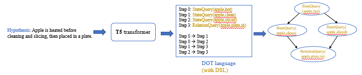

# Task Tracking and Grounding

## To set-up the AI2-THOR environment

### Clone the repository
```
$ git clone https://github.com/rutadesai/VisionLangaugeGrounding.git
$ export GENERATE_DATA=$(pwd)/VisionLangaugeGrounding/alfred
$ cd $GENERATE_DATA
```

### Install all requirements
```
$ conda create -n <virtual_env> python==3.10.0
$ source activate <virtual_env>
$ bash install_requirements.sh
```


## Data Generation

[comment]: <> (Get dependencies and compile the planner)

[comment]: <> (```)

[comment]: <> ($ sudo apt-get install ffmpeg flex bison)

[comment]: <> ($ cd $GENERATE_DATA/gen/ff_planner)

[comment]: <> ($ make)

[comment]: <> (```)

### Generate dataset
```
$ cd $GENERATE_DATA/gen
$ python scripts/generate_trajectories.py --save_path <your save path> --split_type <split_type>

# append the following to generate with multiprocessing for faster generation
# --num_threads <num_threads> --in_parallel 
```
The data is generated in: save_path
Here, split_type can be one of the following ["train", "sub_goal_composition", "verb_noun_composition",
                                 "context_goal_composition", "context_verb_noun_composition", "abstraction"]

### Generate Layouts
If you want to generate new layouts (aside from the generated layouts in [alfred/gen/layouts](https://github.com/rutadesai/VisionLangaugeGrounding/tree/main/alfred/gen/layouts)),

```
$ cd $GENERATE_DATA/gen
$ python layouts/precompute_layout_locations.py 
```

### Define new goals and generate data corresponding to those goals

* Define the goal conditions in [alfred/gen/goal_library.py](https://github.com/rutadesai/VisionLangaugeGrounding/blob/main/alfred/gen/goal_library.py)
* Add the list of goals in [alfred/gen/constants.py](https://github.com/rutadesai/VisionLangaugeGrounding/blob/main/alfred/gen/constants.py)
* Add the goal_variables in [alfred/gen/scripts/generate_trajectories.py](https://github.com/rutadesai/VisionLangaugeGrounding/blob/main/alfred/gen/scripts/generate_trajectories.py)
* Run the following commands:
```
$ cd $GENERATE_DATA/gen
$ python scripts/generate_trajectories.py --save_path <your save path>
```

To simply run the fastforward planner on the generated pddl problem
```
$ cd $GENERATE_DATA/gen
$ ff_planner/ff -o planner/domains/PutTaskExtended_domain.pddl -s 3 -f logs_gen/planner/generated_problems/problem_<num>.pddl
```

### Generated dataset tree
```
dataset/
├── test_splits
│   ├── abstraction
│   ├── context_goal_composition
│   ├── context_verb_noun_composition
│   ├── sub_goal_composition
│   └── verb_noun_composition
└── train
|   ├── heat_then_clean_then_slice
|   │   └── Apple-None-None-27
|   │       └── trial_T20220917_235349_019133
|   │           ├── pddl_states
|   │           ├── traj_data.json
|   │           └── video.mp4
```

### Test Splits

[$GENERATE_DATA/gen/scripts/generate_trajectories.py](https://github.com/rutadesai/VisionLangaugeGrounding/blob/main/alfred/gen/scripts/generate_trajectories.py)  
Note no split (train or test) have overlapping examples.

#### [Scenes: 1-25]
1. **sub-goal composition**:
    >* all tasks not in train

2. **verb-noun composition**: 
    >* heat(egg)
    >* clean(plate)
    >* slice(lettuce)
    >* place(in, shelf)
    
3. **context-verb-noun composition**:
    >* heat(tomato) in scenes 1-5
    >* cool(cup) in scenes 6-10
    >* place(in, coutertop) in scenes 11-15
    >* slice(potato) in scenes 16-20
    >* clean(knife, fork, spoon) in scenes 21-25

4. **abstraction**:
    >* all train tasks with highly abstracted hypothesis ([$GENERATE_DATA/gen/goal_library_abstraction.py](https://github.com/rutadesai/VisionLangaugeGrounding/blob/main/alfred/gen/goal_library_abstraction.py))
    >* for the rest of the splits ([$GENERATE_DATA/gen/goal_library.py](https://github.com/rutadesai/VisionLangaugeGrounding/blob/main/alfred/gen/goal_library.py))
    
#### [Scenes: 26-30]
5. **context-goal composition**: 
    >* all train tasks in scenes in 26-30


<details>
  <summary>View of traj_data.json</summary>

```json
{
"dataset_params": {
        "video_frame_rate": 5
    },
    "images": [
      {
        "bbox": {
          "Baseboard.022|2.38|0|-1.02": [
            0.0,
            348.0,
            73.0,
            438.0
          ],
          "Bowl|-00.03|+00.76|+01.36": [
            31.0,
            284.0,
            68.0,
            309.0
          ]
        },
      "before": "True",
      "high_idx": 0,
      "image_name": "000000000.png",
      "low_idx": 0
      }
    ],
    "objects_metadata": [
      [
        {"assetId": "",
        "axisAlignedBoundingBox": {
                    "center": {
                        "x": 2.1940131187438965,
                        "y": 1.8911657333374023,
                        "z": 2.4240050315856934
                    },"cornerPoints": [
                        [
                            2.357738494873047,
                            2.297971725463867,
                            2.6044836044311523
                        ],
                        [
                            2.357738494873047,
                            2.297971725463867,
                            2.2435264587402344
                        ],
                        [
                            2.357738494873047,
                            1.4843597412109375,
                            2.6044836044311523
                        ],
                        [
                            2.357738494873047,
                            1.4843597412109375,
                            2.2435264587402344
                        ],
                        [
                            2.030287742614746,
                            2.297971725463867,
                            2.6044836044311523
                        ],
                        [
                            2.030287742614746,
                            2.297971725463867,
                            2.2435264587402344
                        ],
                        [
                            2.030287742614746,
                            1.4843597412109375,
                            2.6044836044311523
                        ],
                        [
                            2.030287742614746,
                            1.4843597412109375,
                            2.2435264587402344
                        ]
                    ],
                    "size": {
                        "x": 0.3274507522583008,
                        "y": 0.8136119842529297,
                        "z": 0.36095714569091797
                    }
        },
        "breakable": false,
                "canBeUsedUp": false,
                "canFillWithLiquid": false,
                "controlledObjects": null,
                "cookable": false,
                "dirtyable": false,
                "distance": 2.9920334815979004,
                "fillLiquid": null,
                "isBroken": false,
                "isColdSource": false,
                "isCooked": false,
                "isDirty": false,
                "isFilledWithLiquid": false,
                "isHeatSource": false,
                "isInteractable": false,
                "isMoving": false,
                "isOpen": false,
                "isPickedUp": false,
                "isSliced": false,
                "isToggled": false,
                "isUsedUp": false,
                "mass": 0.0,
                "moveable": false,
                "name": "Cabinet_0676cbe2",
                "objectId": "Cabinet|+02.04|+02.11|+02.62",
                "objectOrientedBoundingBox": null,
                "objectType": "Cabinet",
                "openable": true,
                "openness": 0.0,
                "parentReceptacles": null,
                "pickupable": false,
                "position": {
                    "x": 2.04144287109375,
                    "y": 2.1134581565856934,
                    "z": 2.618363618850708
                },
                "receptacle": true,
                "receptacleObjectIds": [],
                "rotation": {
                    "x": -0.0,
                    "y": 0.0,
                    "z": 0.0
                },
                "salientMaterials": null,
                "sliceable": false,
                "temperature": "RoomTemp",
                "toggleable": false,
                "visible": false
            },  
      ]
    ],
    "pddl_params": {
        "mrecep_target": "",
        "object_sliced": false,
        "object_target": "Apple",
        "parent_target": "",
        "toggle_target": ""
    },
    "plan": {
      "high_pddl": [{
                "discrete_action": {
                    "action": "GotoLocation",
                    "args": [
                        "sink"
                    ]
                },
                "high_idx": 0,
                "planner_action": {
                    "action": "GotoLocation",
                    "location": "loc|5|8|0|45"
                }
            }],
      "low_actions": [
            {
                "api_action": {
                    "action": "LookDown"
                },
                "discrete_action": {
                    "action": "LookDown_15",
                    "args": {}
                },
                "high_idx": 0,
                "state_metadata": [
                    {
                        "assetId": "",
                        "axisAlignedBoundingBox": {
                            "center": {
                                "x": 2.1940131187438965,
                                "y": 1.8911657333374023,
                                "z": 2.4240050315856934
                            },
                        "cornerPoints": [
                                [
                                    2.357738494873047,
                                    2.297971725463867,
                                    2.6044836044311523
                                ]],
                            "size": {
                                "x": 0.3274507522583008,
                                "y": 0.8136119842529297,
                                "z": 0.36095714569091797
                            }},
                        "cleanable": false,
                        "coolable": false,
                        "heatable": false,
                        "holdsAny": false,
                        "inReceptacle": null,
                        "isClean": false,
                        "isCool": false,
                        "isHot": false,
                        "isOn": false,
                        "isOpen": false,
                        "isSliced": false,
                        "isToggled": false,
                        "moveable": false,
                        "name": "Cabinet_0676cbe2",
                        "objectId": "Cabinet|+02.04|+02.11|+02.62",
                        "objectOrientedBoundingBox": null,
                        "objectType": "Cabinet",
                        "openable": true,
                        "pickupable": false,
                        "position": {
                            "x": 2.04144287109375,
                            "y": 2.1134581565856934,
                            "z": 2.618363618850708
                        },
                        "receptacleAtLocation": [
                            6,
                            8,
                            0,
                            -30
                        ],
                        "receptacleType": "Cabinet",
                        "rotation": {
                            "x": -0.0,
                            "y": 0.0,
                            "z": 0.0
                        },
                        "salientMaterials": null,
                        "sliceable": false,
                        "toggleable": false,
                        "visible": false
                    }
                ]
            }
      ]
    },
    "scene": {
        "dirty_and_empty": false,
        "floor_plan": "FloorPlan27",
        "init_action": {
            "action": "TeleportFull",
            "horizon": 30,
            "rotation": 0,
            "standing": true,
            "x": 1.25,
            "y": 0.9010001420974731,
            "z": 0.0
        },
        "object_poses": [
            {
                "objectName": "Egg_fa86d803",
                "position": {
                    "x": 0.6937957406044006,
                    "y": 0.8302623629570007,
                    "z": 2.606858730316162
                },
                "rotation": {
                    "x": 3.1054576538736e-05,
                    "y": 6.309879840848964e-10,
                    "z": 0.0014264412457123399
                }
            }],
    "state_metadata": [[
                    {
                        "assetId": "",
                        "axisAlignedBoundingBox": {
                            "center": {
                                "x": 2.1940131187438965,
                                "y": 1.8911657333374023,
                                "z": 2.4240050315856934
                            },
                            "cornerPoints": [
                                [
                                    2.357738494873047,
                                    2.297971725463867,
                                    2.6044836044311523
                                ],
                                [
                                    2.357738494873047,
                                    2.297971725463867,
                                    2.2435264587402344
                                ],
                                [
                                    2.357738494873047,
                                    1.4843597412109375,
                                    2.6044836044311523
                                ],
                                [
                                    2.357738494873047,
                                    1.4843597412109375,
                                    2.2435264587402344
                                ],
                                [
                                    2.030287742614746,
                                    2.297971725463867,
                                    2.6044836044311523
                                ],
                                [
                                    2.030287742614746,
                                    2.297971725463867,
                                    2.2435264587402344
                                ],
                                [
                                    2.030287742614746,
                                    1.4843597412109375,
                                    2.6044836044311523
                                ],
                                [
                                    2.030287742614746,
                                    1.4843597412109375,
                                    2.2435264587402344
                                ]
                            ],
                            "size": {
                                "x": 0.3274507522583008,
                                "y": 0.8136119842529297,
                                "z": 0.36095714569091797
                            }
                        },
                        "cleanable": false,
                        "coolable": false,
                        "heatable": false,
                        "holdsAny": false,
                        "inReceptacle": null,
                        "isClean": false,
                        "isCool": false,
                        "isHot": false,
                        "isOn": false,
                        "isOpen": false,
                        "isSliced": false,
                        "isToggled": false,
                        "moveable": false,
                        "name": "Cabinet_0676cbe2",
                        "objectId": "Cabinet|+02.04|+02.11|+02.62",
                        "objectOrientedBoundingBox": null,
                        "objectType": "Cabinet",
                        "openable": true,
                        "pickupable": false,
                        "position": {
                            "x": 2.04144287109375,
                            "y": 2.1134581565856934,
                            "z": 2.618363618850708
                        },
                        "receptacleAtLocation": [
                            6,
                            8,
                            0,
                            -30
                        ],
                        "receptacleType": "Cabinet",
                        "rotation": {
                            "x": -0.0,
                            "y": 0.0,
                            "z": 0.0
                        },
                        "salientMaterials": null,
                        "sliceable": false,
                        "toggleable": false,
                        "visible": false
                    }],
    "task_id": "trial_T20220917_235349_019133",
    "task_type": "heat_then_clean_then_slice",
    "template": {
        "neg": "apple is heated, then sliced, then cleaned in a SinkBasin",
        "pos": "apple is picked, then heated, then cleaned in a SinkBasin, then sliced"
    }
}
```
</details>

## Dataset Stats 
For details: [ablations/data_analysis.ipynb](https://github.com/rutadesai/VisionLangaugeGrounding/blob/main/ablations/data_analysis.ipynb)

* Total hours: 170 hours
  * Train: 112 hours
  * Test: 58 h
* Average video-length > 1 min
* Tasks: 82
* Objects: 32 (with visual variations)
* Receptacles: 13 (excluding movable receptacles)
* High-level Actions: 7 (GotoLocation, PickupObject, PutObject, SliceObject, CleanObject, HeatObject, CoolObject)
* Low-level Actions: 12 (LookUp, LookDown, MoveAhead, RotateRight, RotateLeft, OpenObject, CloseObject, ToggleObjectOn, ToggleObjectOff, SliceObject, PickupObject, PutObject)
* Average number of high-level actions (sub-goals) per sample: 10
* Average number of low-level actions per sample: > 50
* Scenes: 30 (Kitchens)


## Baselines

### Setup Baselines:

```
$ export DATA_ROOT=<path to dataset>
$ export BASELINES=$(pwd)/VisionLangaugeGrounding/baselines
$ cd $BASELINES
$ sudo apt install graphviz
$ pip install -r baseline_requirements.txt # install requirements
```

Also, 
``` python
import nltk
nltk.download('punkt')
```

### Run baselines

```
$ cd $BASELINES/end2end/violin

# train
$ CUDA_VISIBLE_DEVICES=${GPU_ID} python -m torch.distributed.launch --nproc_per_node=$NGPUS violin_baseline.py --num_workers $NWorkers --split_type "train" --batch_size 64 --text_feature_extractor <"bert/glove"> --visual_feature_extractor <"i3d/resnet"> --run_id $run_id --sample_rate 3
# if data split not preprocessed, specify "--preprocess" in the previous step
# for attention-based models, specify "--attention" in the previous step

# test (split_type = {"sub_goal_composition", "verb_noun_composition", "context_verb_noun_composition", "context_goal_composition", "abstraction"})
$ CUDA_VISIBLE_DEVICES=${GPU_ID} python -m torch.distributed.launch --nproc_per_node=$NGPUS test_baseline.py --num_workers $NWorkers --split_type <split_type> --batch_size 128 --sample_rate 3 --run_id $run_id --text_feature_extractor <"bert/glove/clip"> --visual_feature_extractor <"i3d/resnet/mvit/clip">
# if data split not preprocessed, specify "--preprocess" in the previous step
# for attention-based models, specify "--attention" in the previous step
```

Note: to run the I3D model, you must download the pretrained model (rgb_imagenet.pt) from this repository: 
[https://github.com/piergiaj/pytorch-i3d/tree/master/models](https://github.com/piergiaj/pytorch-i3d/tree/master/models)
```
$ mkdir $BASELINES/i3d/models
$ wget -P $BASELINES/i3d/models "https://github.com/piergiaj/pytorch-i3d/tree/master/models/rgb_imagenet.pt" "https://github.com/piergiaj/pytorch-i3d/tree/master/models/rgb_charades.pt"
```

Alternatively, modify and run from root
```
$ ./run_train.sh
# ./run_test.sh
```


### Run proScript
```
$ source activate alfred_env
$ export DATA_ROOT=<path to dataset>
$ export BASELINES=$(pwd)/VisionLangaugeGrounding/baselines
$ cd $BASELINES/proScript

# train
$ CUDA_VISIBLE_DEVICES=0,1,2,3,4,5,6,7 python -m torch.distributed.launch --nproc_per_node=8 train_supervised.py --num_workers 4 --batch_size 32 --preprocess --test_split <> --run_id <> --epochs 20
# test
$ CUDA_VISIBLE_DEVICES=0,1,2,3,4,5,6,7 python -m torch.distributed.launch --nproc_per_node=8 test.py --num_workers 4 --batch_size 32 --preprocess --test_split <> --run_id <>
```
<--output_type 'nl'> for natural language graph output; 
<--output_type 'dsl'> for domain-specific language graph output (default: dsl)



## NeSy Model

```
$ source activate alfred_env
$ export DATA_ROOT=/fb-agios-acai-efs/dataset
$ export BASELINES=$(pwd)/VisionLangaugeGrounding/baselines
$ cd VisionLangaugeGrounding/nesy
$ CUDA_VISIBLE_DEVICES=0,1,2,3,4,5,6,7 python -m torch.distributed.launch --nproc_per_node=8 --master_port 29500 nesy_v1.py --num_workers 2 --split_type 'train' --batch_size 64 --sample_rate 2 --run_id 50 --fp_seg 12
```


### Ablations
[ablations/](https://github.com/rutadesai/VisionLangaugeGrounding/tree/main/ablations)
```
$ source activate alfred_env
$ export DATA_ROOT=/fb-agios-acai-efs/dataset
$ export BASELINES=$(pwd)/VisionLangaugeGrounding/baselines
$ export CKPTS=/fb-agios-acai-efs/rishi/best_model_ckpts
$ cd VisionLangaugeGrounding/ablations
$ CUDA_VISIBLE_DEVICES=0,1,2,3,4,5,6,7 python -m torch.distributed.launch --nproc_per_node=8 complexity_ordering.py --num_workers 0 --split_type --batch_size 16 --sample_rate 3 --visual_feature_extractor 'mvit' --text_feature_extractor 'bert' --run_id 1
```

## References
[1] Jingzhou Liu, Wenhu Chen, Yu Cheng, Zhe Gan, Licheng Yu, Yiming Yang, Jingjing Liu ["VIOLIN: A Large-Scale Dataset for Video-and-Language Inference"](https://openaccess.thecvf.com/content_CVPR_2020/papers/Liu_Violin_A_Large-Scale_Dataset_for_Video-and-Language_Inference_CVPR_2020_paper.pdf). In CVPR 2020  
[2] Eric Kolve, Roozbeh Mottaghi, Winson Han, Eli VanderBilt, Luca Weihs, Alvaro Herrasti, Matt Deitke, Kiana Ehsani, Daniel Gordon, Yuke Zhu, Aniruddha Kembhavi, Abhinav Gupta, Ali Farhadi ["AI2-THOR: An Interactive 3D Environment for Visual AI"](https://arxiv.org/pdf/1712.05474.pdf)  
[3] Mohit Shridhar,	Jesse Thomason,	Daniel Gordon,	Yonatan Bisk, Winson Han, Roozbeh Mottaghi,	Luke Zettlemoyer, Dieter Fox ["ALFRED: A Benchmark for Interpreting Grounded Instructions for Everyday Tasks"](https://arxiv.org/abs/1912.01734) In CVPR 2020  
[4] Joao Carreira, Andrew Zisserman ["Quo Vadis, Action Recognition? A New Model and the Kinetics Dataset"](https://openaccess.thecvf.com/content_cvpr_2017/papers/Carreira_Quo_Vadis_Action_CVPR_2017_paper.pdf) In CVPR 2017  
[5] Alec Radford, Jong Wook Kim, Chris Hallacy, Aditya Ramesh, Gabriel Goh, Sandhini Agarwal, Girish Sastry, Amanda Askell, Pamela Mishkin, Jack Clark, Gretchen Krueger, Ilya Sutskever ["Learning Transferable Visual Models From Natural Language Supervision"](http://proceedings.mlr.press/v139/radford21a/radford21a.pdf) In ICML 2021  
[6] Haoqi Fan, Bo Xiong, Karttikeya Mangalam, Yanghao Li, Zhicheng Yan, Jitendra Malik, Christoph Feichtenhofer ["Multiscale Vision Transformers"](https://openaccess.thecvf.com/content/ICCV2021/papers/Fan_Multiscale_Vision_Transformers_ICCV_2021_paper.pdf) In ICCV 2021  
[7] Saining Xie, Chen Sun, Jonathan Huang, Zhuowen Tu, Kevin Murphy ["Rethinking Spatiotemporal Feature Learning: Speed-Accuracy Trade-offs in Video Classification"](https://openaccess.thecvf.com/content_ECCV_2018/papers/Saining_Xie_Rethinking_Spatiotemporal_Feature_ECCV_2018_paper.pdf) In ECCV 2018  
[8] Keisuke Sakaguchi, Chandra Bhagavatula, Ronan Le Bras, Niket Tandon, Peter Clark, Yejin Choi ["proScript: Partially Ordered Scripts Generation"](https://aclanthology.org/2021.findings-emnlp.184/) In Findings of EMNLP 2021  
[9] Colin Raffel, Noam Shazeer, Adam Roberts, Katherine Lee, Sharan Narang, Michael Matena, Yanqi Zhou, Wei Li, Peter J. Liu ["Exploring the Limits of Transfer Learning with a Unified Text-to-Text Transformer"](https://jmlr.org/papers/volume21/20-074/20-074.pdf) In JMLR 2020
