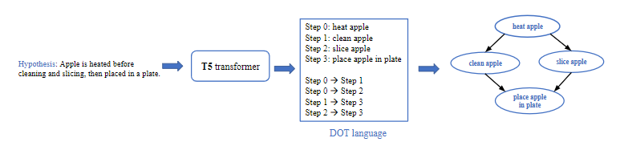
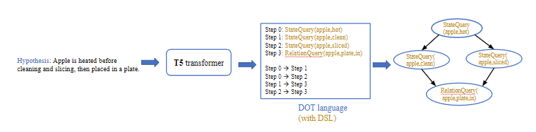

# proScript [2]

* script generation from natural language
* uses a T5-small transformer [1] for graph generation
* trained on all positively entailed hypotheses of the dataset
* output graph is represented using DOT language
* nodes of the graph can either be natural language 'nl' or domain specific language 'dsl'

[1] Colin Raffel, Noam Shazeer, Adam Roberts, Katherine Lee, Sharan Narang, Michael Matena, Yanqi Zhou, Wei Li, Peter J. Liu ["Exploring the Limits of Transfer Learning with a Unified Text-to-Text Transformer"](https://jmlr.org/papers/volume21/20-074/20-074.pdf) In JMLR 2020    
[2] Keisuke Sakaguchi, Chandra Bhagavatula, Ronan Le Bras, Niket Tandon, Peter Clark, Yejin Choi ["proScript: Partially Ordered Scripts Generation"](https://aclanthology.org/2021.findings-emnlp.184/) In Findings of EMNLP 2021  